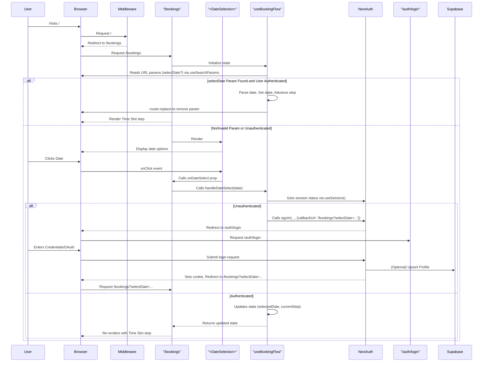

# Login Flow Refactor - Deep Analysis (v2)

## 1. Overview

This document provides a detailed analysis of the dependencies, data flow, and potential impacts involved in refactoring the application\'s authentication flow. The goal is to:
1.  Make `/bookings` the primary landing page instead of `/auth/login`.
2.  Allow unauthenticated users to view the initial booking step (date selection).
3.  Trigger the login process only when an unauthenticated user attempts to select a date.
4.  **Automatically select the originally intended date after successful login**, avoiding a "double click".
5.  Explicitly configure the session to expire only after **30 days of inactivity**, regardless of intermediate activity.

## 2. Current Flow (Summary)

User visits `/` -> Redirected to `/auth/login` -> Logs in -> Redirected to `/bookings` -> `useEffect` checks auth (redundant) -> User selects date -> UI advances. Session uses NextAuth defaults.

## 3. Proposed Flow (v2 - Auto-Selecting Date)

1.  User visits `/`.
2.  `middleware.ts` redirects the user to `/bookings`.
3.  `app/(features)/bookings/page.tsx` loads. The immediate auth check in `useEffect` is removed. Unauthenticated users can view `<DateSelection>`.
4.  *(Post-Login Auto-Selection)*: A `useEffect` hook in `useBookingFlow` (or `bookings/page.tsx`) runs on mount. It checks `useSearchParams` for a `selectDate` parameter. If found *and* user is authenticated, it parses the date, calls the internal date selection logic, and advances the step. Clears the URL parameter. Displays loading state during this process.
5.  User interacts with `<DateSelection>`. Clicking a date calls `handleDateSelect` in `useBookingFlow`.
6.  `handleDateSelect` (in `useBookingFlow`) checks `useSession().status`.
    *   **Authenticated:** Updates state (`selectedDate`, `currentStep`), UI transitions to time selection.
    *   **Unauthenticated:** Calls `signIn(provider?, { callbackUrl: \`/bookings?selectDate=\${date.toISOString()}\` })`. User is redirected to `/auth/login`.
7.  User authenticates via `/auth/login`.
8.  NextAuth processes login (`app/api/auth/options.ts`), potentially interacting with Supabase, sets session cookie.
9.  NextAuth redirects user back to `/bookings?selectDate=...` (via `callbackUrl`).
10. User lands on `/bookings`. The `useEffect` (Step 4) runs, finds the `selectDate` param, validates it, auto-selects the date, and advances the UI state.
11. Session lifetime is explicitly configured in `app/api/auth/options.ts` (`maxAge: 30d`, `updateAge: 0`).

## 4. Affected Components & Logic Analysis (v2 Updates)

*   **`middleware.ts`**:
    *   **Change:** Modify `/` redirect target to `/bookings`. Remove the specific `!token && pathname.startsWith(\'/bookings\')` check block. (No change from v1 analysis).

*   **`app/page.tsx`**:
    *   **Change:** Remove the `redirect(\'/auth/login\')`. (No change from v1 analysis).

*   **`app/(features)/bookings/page.tsx`**:
    *   **Change:** Remove the `useEffect` block that checks `status === \'unauthenticated\'`. May optionally contain the `useEffect` for reading the `selectDate` URL parameter if not placed in the hook.
    *   **Dependencies:** `useSession`, `useRouter`, `useSearchParams` (if logic here), `Layout`, step components, `useBookingFlow`.

*   **`app/(features)/bookings/hooks/useBookingFlow.ts`**:
    *   **Change:**
        *   Inject `useSession`, `signIn`, `useRouter`, `useSearchParams`.
        *   Modify `handleDateSelect`:
            *   Check `session.status`.
            *   If unauthenticated, call `signIn` with the modified `callbackUrl` including `selectDate` parameter.
            *   If authenticated, proceed with internal state update logic.
        *   Add `useEffect` hook:
            *   Runs on mount / when `session.status` becomes `authenticated`.
            *   Reads `selectDate` from `useSearchParams`.
            *   If valid date found: Parses it, calls internal logic to set date state & advance step, uses `router.replace` to remove query param from URL.
            *   Handles potential parsing errors gracefully.
    *   **Dependencies:** `useState`, `useEffect`, `useSession`, `signIn`, `useRouter`, `useSearchParams`.
    *   **Impact:** Becomes main controller for both user-triggered and auto-triggered date selection, handles auth check, and post-login state restoration. Increased complexity.

*   **`app/(features)/bookings/components/booking/steps/DateSelection.tsx`**:
    *   **Change:** None required. (No change from v1 analysis).

*   **`app/api/auth/options.ts`**:
    *   **Change:** Add the `session: { strategy: \'jwt\', maxAge: 30 * 24 * 60 * 60, updateAge: 0 }` configuration object.
    *   **Impact:** Explicitly defines session lifetime as 30 days from login, disabling activity-based extension.

*   **Other Components (`next-auth`, Supabase):** No changes from v1 analysis.

## 5. Key Dependencies & Data Flow (Proposed v2)

## 6. Session Management Changes (v2)

*   **`maxAge: 30 * 24 * 60 * 60` (30 days):** Session cookie/JWT expires 30 days after last issuance (login time).
*   **`updateAge: 0`:** Session is **not** refreshed based on user activity. Inactivity for 30 days requires re-login.

## 7. Potential Risks & Considerations (v2 Update)

*   **UX:** "Double Click" issue resolved by auto-selection.
*   **Complexity:** Auto-selection logic adds complexity to `useBookingFlow` / `bookings/page.tsx`. Requires careful implementation and testing.
*   **State Preservation:** Handled via URL parameter for the selected date. Other transient UI state might still be lost on redirect.
*   **Error Handling:** Need robust parsing/validation for the `selectDate` URL parameter. Failed logins still redirect to error page.
*   **API Protection:** Verify API routes called during booking are still covered by middleware or have internal checks.
*   **Loading States:** Implement visual feedback (e.g., loading spinner) while the auto-selection logic runs after login redirect.
*   **Proactive Login:** Recommend adding a manual "Login / My Account" link in the header (`Layout.tsx`).
*   **Testing:** Thoroughly test the auto-selection flow, various login paths, session expiry exactly at 30 days, error conditions (invalid param, failed login), and browser back button use cases. 