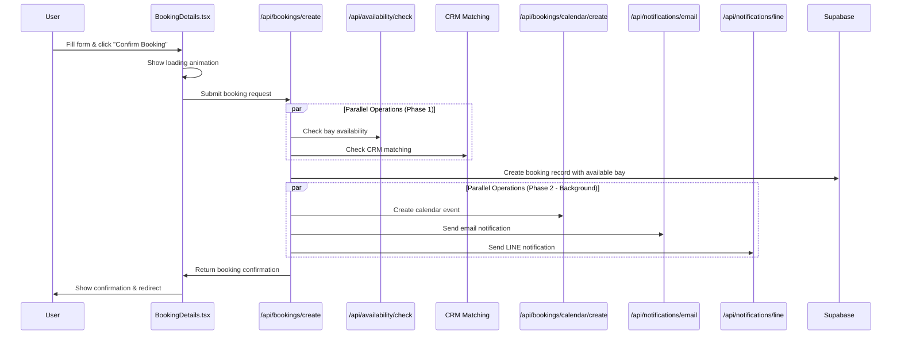

# Booking Process Flow Documentation

## Overview

This document describes the optimized booking process flow implemented according to the booking process optimization plan. The new architecture leverages parallel processing, specialized endpoints, and consistent data formatting to improve performance, reliability, and scalability.

## Architecture Components

### Core Components

1. **Booking Orchestrator** (`/api/bookings/create/route.ts`)
   - Central component that orchestrates the entire booking process
   - Runs bay availability check and CRM matching in parallel
   - Creates booking record with assigned bay
   - Triggers calendar event creation and notifications in parallel
   - Returns quick response to user

2. **Bay Availability Checker** (`/api/availability/check/route.ts`)
   - Specialized endpoint for finding an available bay for a specific timeslot
   - Optimized Google Calendar API calls
   - Timeout handling for reliability

3. **Calendar Event Creator** (`/api/bookings/calendar/create/route.ts`)
   - Specialized endpoint for creating calendar events
   - Updates booking status after calendar event creation
   - Handles package information

4. **Notification Endpoints**
   - Email Notification (`/api/notifications/email/route.ts`)
   - LINE Notification (`/api/notifications/line/route.ts`)
   - Both updated to handle standardized data format

5. **Utility Components**
   - Booking Formatter (`/utils/booking-formatter.ts`) - Ensures consistent data formatting
   - Parallel Processing (`/utils/parallel-processing.ts`) - Executes tasks in parallel with timeout handling
   - Customer Matching (`/utils/customer-matching.ts`) - Handles CRM customer matching

## Process Flow

## Detailed Flow Description

### 1. User Submits Booking Form

The user fills out the booking form in the `BookingDetails.tsx` component and clicks "Confirm Booking".

### 2. Frontend Sends Request to Booking Orchestrator

The frontend sends a POST request to `/api/bookings/create` with the booking details:
- Name
- Email
- Phone number
- Date
- Start time
- Duration
- Number of people

### 3. Booking Orchestrator Processes Request

The booking orchestrator performs the following steps:

1. **Authentication**: Verifies the user's authentication token
2. **Request Parsing**: Validates required fields
3. **Date Parsing**: Formats date and time for availability check
4. **Parallel Operations**:
   - Checks bay availability via `/api/availability/check`
   - Performs CRM matching to find existing customer records
5. **Booking Creation**: Creates a booking record in Supabase with status "pending"
6. **Data Formatting**: Uses the booking formatter to standardize data for all services
7. **Background Operations**: Triggers in parallel (non-blocking):
   - Calendar event creation via `/api/bookings/calendar/create`
   - Email notification via `/api/notifications/email`
   - LINE notification via `/api/notifications/line`
8. **Response**: Returns success response to the user immediately with booking ID and bay information

### 4. Bay Availability Check

The bay availability checker performs the following steps:

1. Parses the request for date, start time, and duration
2. Checks all bays in parallel using optimized Google Calendar API calls
3. Returns the first available bay or an error if no bays are available

### 5. Calendar Event Creation

The calendar event creator performs the following steps:

1. Retrieves the booking details from Supabase
2. Gets CRM customer data if available
3. Checks for active packages based on the stable hash ID
4. Creates a calendar event in Google Calendar
5. Updates the booking record with status "confirmed" and calendar event ID

### 6. Notifications

Both email and LINE notifications are sent in parallel:

1. Each notification endpoint receives standardized data from the booking formatter
2. The email notification sends a confirmation email to the customer
3. The LINE notification sends a booking notification to the staff LINE group

## Performance Optimizations

1. **Parallel Processing**: Operations that can run in parallel are executed concurrently
2. **Early Response**: The user receives a response as soon as the booking record is created
3. **Optimized API Calls**: Google Calendar API calls are optimized to fetch only necessary data
4. **Timeout Handling**: All operations have timeouts to prevent long-running requests
5. **Consistent Data Formatting**: Centralized data formatting reduces duplication and ensures consistency

## Error Handling

1. **Bay Availability**: If no bays are available, the user receives an error message
2. **Calendar Event Creation**: If calendar event creation fails, the booking status is updated to "failed"
3. **Notification Failures**: Notification failures are logged but don't block the booking process

## Conclusion

The optimized booking process provides a faster, more reliable experience for users while maintaining data consistency across all services. By leveraging parallel processing and specialized endpoints, the system can handle more bookings efficiently and scale better under load. 