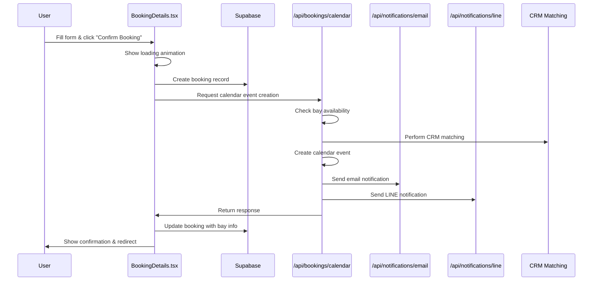
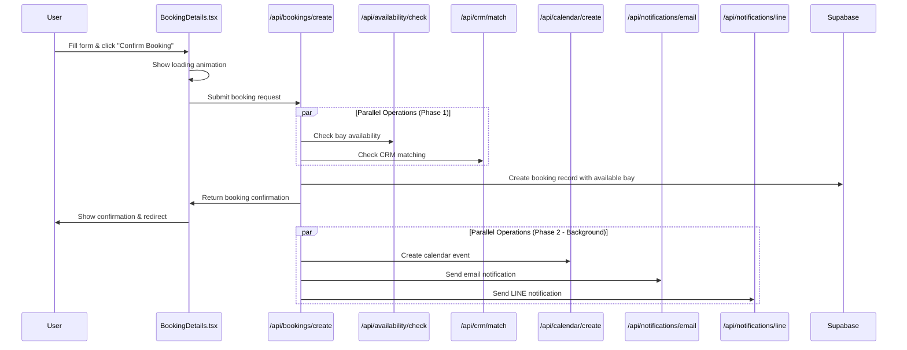

# Booking Process Optimization Plan

## Executive Summary

This document outlines a focused plan to optimize the booking process for improved performance, reliability, and scalability. The revised approach implements true parallel processing, leverages specialized endpoints, and ensures consistent data handling across all services.

## Current Architecture Analysis

### Existing Solution Documentation

#### File Structure

```
app/
├── (features)/
│   └── bookings/
│       ├── components/
│       │   └── booking/
│       │       └── steps/
│       │           ├── BookingDetails.tsx  # Frontend booking form and submission logic
│       │           └── TimeSlots.tsx       # Timeslot selection component
│       └── confirmation/
│           └── page.tsx                    # Booking confirmation page
├── api/
│   ├── availability/
│   │   └── route.ts                        # API for checking timeslot availability (used by useAvailability hook)
│   ├── bookings/
│   │   └── calendar/
│   │       └── route.ts                    # API for creating calendar events and handling notifications
│   ├── crm/
│   │   ├── mapping/
│   │   │   └── route.ts                    # API for retrieving CRM customer mappings
│   │   └── match/
│   │       └── route.ts                    # API for matching profiles with CRM customers
│   └── notifications/
│       ├── email/
│       │   └── route.ts                    # API for sending email notifications
│       └── line/
│           └── route.ts                    # API for sending LINE notifications
└── utils/
    └── customer-matching.ts                # Utility functions for CRM customer matching
```

#### Current Process Flow



#### Bay Availability Usage Points

Bay availability is currently checked in two different ways:

1. **TimeSlots Component**: Uses `/api/availability` endpoint via the `useAvailability.ts` hook to load all available timeslots for a date
2. **Booking Confirmation**: Uses `findAvailableBay` function in `/api/bookings/calendar/route.ts` to find a specific available bay for a booking

These are two separate functionalities:
- The first checks which timeslots are available on a date
- The second finds an available bay for a specific timeslot

### Identified Issues

1. **Sequential Processing**: Operations that could run in parallel are executed sequentially
2. **Centralized Processing**: The calendar API is handling too many responsibilities
3. **Dependency Chain**: Failures in non-critical operations affect the entire booking process
4. **Inefficient Resource Utilization**: The current approach doesn't leverage specialized endpoints effectively
5. **User Experience**: Users wait longer than necessary for confirmation
6. **Timeout Risks**: Long-running operations risk hitting API timeout limits (30s as per vercel.json)
7. **Inefficient Bay Availability Check**: The bay availability check in the booking confirmation process could be optimized and isolated
8. **Data Inconsistency**: Notification endpoints receive differently formatted data

## Proposed Architecture

### Core Principles

1. **True Parallel Processing**: Execute independent operations concurrently from the start
2. **Specialized Endpoints**: Use dedicated endpoints for specific functions
3. **Minimal Dependencies**: Reduce dependencies between operations
4. **Early User Feedback**: Confirm booking to user as soon as critical operations complete
5. **Resilience**: Ensure the system can recover from partial failures
6. **Data Consistency**: Centralize data formatting for all services
7. **Optimized Components**: Create an optimized bay availability checker for the booking process

### New Booking Flow



## Proposed File Structure

```
app/
├── (features)/
│   └── bookings/
│       ├── components/
│       │   └── booking/
│       │       └── steps/
│       │           ├── BookingDetails.tsx       # Updated to use new API endpoints
│       │           └── TimeSlots.tsx            # Remains unchanged, uses existing availability endpoint
│       └── confirmation/
│           └── page.tsx
├── api/
│   ├── availability/
│   │   ├── check/
│   │   │   └── route.ts                     # New optimized bay availability checker
│   │   └── route.ts                         # Existing endpoint (remains unchanged)
│   ├── bookings/
│   │   ├── create/
│   │   │   └── route.ts                     # New booking orchestrator
│   │   └── calendar/
│   │       ├── route.ts                     # Original endpoint (deprecated)
│   │       └── create/
│   │           └── route.ts                 # New specialized calendar event creator
│   ├── crm/
│   │   ├── mapping/
│   │   │   └── route.ts
│   │   └── match/
│   │       └── route.ts
│   └── notifications/
│       ├── email/
│       │   └── route.ts                     # Updated to handle standardized data
│       └── line/
│           └── route.ts                     # Updated to handle standardized data
└── utils/
    ├── booking-formatter.ts                 # New utility for consistent data formatting
    ├── customer-matching.ts                 # Existing utility
    └── parallel-processing.ts               # New utility for parallel tasks
```

### File Purposes

| File | Purpose |
|------|---------|
| `/api/availability/route.ts` | Existing endpoint for checking available timeslots, used by the TimeSlots component via useAvailability hook. Remains unchanged. |
| `/api/availability/check/route.ts` | New specialized endpoint for finding an available bay for a specific timeslot. Used only by the booking orchestrator. |
| `/api/bookings/create/route.ts` | Central orchestrator for the booking process that executes operations in parallel and ensures data consistency. |
| `/api/bookings/calendar/create/route.ts` | Specialized endpoint for creating calendar events with standardized data. |
| `/utils/booking-formatter.ts` | Utility for formatting booking data consistently across all services (calendar, email, LINE). |
| `/utils/parallel-processing.ts` | Utility for executing tasks in parallel with appropriate error handling and timeouts. |

## Implementation Steps

### Step 1: Set Up Development Branch

Create a new branch `feature/booking-optimization` from the main branch for all development work.

### Step 2: Create Core Components

#### 2.1 Create Bay Availability Service

Create a dedicated endpoint for checking bay availability for a specific timeslot:

```
📁 app/api/availability/check/route.ts
```

**Implementation Details:**
- Extract bay checking logic from `app/api/bookings/calendar/route.ts` (findAvailableBay function)
- Optimize Google Calendar API calls:
  ```typescript
  const events = await calendar.events.list({
    calendarId,
    timeMin: formatInTimeZone(startDateTime, TIMEZONE, "yyyy-MM-dd'T'HH:mm:ssxxx"),
    timeMax: formatInTimeZone(endDateTime, TIMEZONE, "yyyy-MM-dd'T'HH:mm:ssxxx"),
    singleEvents: true,
    timeZone: TIMEZONE,
    // Optimize the response - only fetch IDs, not full events
    fields: "items(id)",
    // We only need to know if any events exist
    maxResults: 1
  });
  ```
- Add timeout handling (5 seconds max)
- Return the first available bay
- Note: This endpoint is different from the existing `/api/availability` endpoint which gets all available timeslots

#### 2.2 Create Booking Data Formatter Utility

Create a utility for consistent data formatting across all services:

```
📁 utils/booking-formatter.ts
```

**Implementation Details:**
```typescript
export function formatBookingData({
  booking,
  crmData,
  bayInfo
}) {
  // Create standardized booking data for all services
  const formattedData = {
    // Common fields for all services
    bookingId: booking.id,
    customerName: crmData?.name || booking.name,
    email: booking.email,
    phoneNumber: booking.phone_number,
    
    // Format dates and times consistently
    date: booking.date,
    formattedDate: format(new Date(booking.date), 'MMMM d, yyyy'),
    startTime: booking.start_time,
    endTime: calculateEndTime(booking.start_time, booking.duration),
    
    // Bay information
    bayId: bayInfo.id,
    bayName: bayInfo.displayName || bayInfo.id,
    
    // User and CRM data
    userId: booking.user_id,
    crmCustomerId: crmData?.id,
    isNewCustomer: !crmData?.id,
    
    // Additional booking details
    duration: booking.duration,
    numberOfPeople: booking.number_of_people,
    
    // Service-specific formatted data
    calendar: {
      summary: `${crmData?.name || booking.name} (${booking.phone_number}) (${booking.number_of_people}) at ${bayInfo.displayName || bayInfo.id}`,
      description: generateCalendarDescription(booking, bayInfo, crmData)
    },
    email: {
      userName: crmData?.name || booking.name,
      subject: `Your LENGOLF Booking Confirmation - ${format(new Date(booking.date), 'MMMM d, yyyy')}`,
      // Additional email-specific fields
    },
    line: {
      bookingName: booking.name,
      customerName: crmData?.name || "New Customer",
      // Additional LINE-specific fields
    }
  };
  
  return formattedData;
}

// Helper to calculate end time from start time and duration
function calculateEndTime(startTime, duration) {
  const [hours, minutes] = startTime.split(':').map(Number);
  const totalMinutes = hours * 60 + minutes + duration * 60;
  const endHours = Math.floor(totalMinutes / 60) % 24;
  const endMinutes = totalMinutes % 60;
  return `${endHours.toString().padStart(2, '0')}:${endMinutes.toString().padStart(2, '0')}`;
}

// Helper to generate a consistent calendar description
function generateCalendarDescription(booking, bayInfo, crmData) {
  return `Customer Name: ${crmData?.name || booking.name}
Contact: ${booking.phone_number}
Email: ${booking.email}
Type: ${booking.package_info || 'Normal Bay Rate'}
Pax: ${booking.number_of_people}
Bay: ${bayInfo.displayName || bayInfo.id}
Date: ${format(new Date(booking.date), 'EEEE, MMMM d')}
Time: ${booking.start_time} - ${calculateEndTime(booking.start_time, booking.duration)}
Via: Website
Booking ID: ${booking.id}`;
}
```

#### 2.3 Create Parallel Processing Utility

Create a utility for executing tasks in parallel:

```
📁 utils/parallel-processing.ts
```

**Implementation Details:**
```typescript
export async function executeParallel(tasks, options = {}) {
  const { timeout = 10000 } = options;
  
  return Promise.all(
    tasks.map(task => {
      // Add timeout to each task
      const timeoutPromise = new Promise((_, reject) => {
        setTimeout(() => reject(new Error(`Task timed out after ${timeout}ms`)), timeout);
      });
      
      return Promise.race([task(), timeoutPromise]);
    })
  );
}
```

#### 2.4 Create Booking Orchestrator

Create the central booking orchestration endpoint:

```
📁 app/api/bookings/create/route.ts
```

**Implementation Details:**
- Authenticate user
- Run bay availability and CRM matching in parallel
- Create booking record with the available bay
- Format booking data consistently using the formatter utility
- Trigger calendar creation and notifications in parallel
- Return quick response to user after booking creation

#### 2.5 Create Dedicated Calendar Event Creator

Create a specialized endpoint for calendar event creation:

```
📁 app/api/bookings/calendar/create/route.ts
```

**Implementation Details:**
- Accept booking ID, date, time, duration, and bay info
- Retrieve additional booking details from Supabase if needed
- Create the calendar event
- Update booking record with calendar event ID
- Use consistent data formatting from the central formatter

### Step 3: Keep TimeSlots Component Unchanged

**Important Note:**
- The `TimeSlots.tsx` component will continue using the existing `/api/availability` endpoint via the `useAvailability.ts` hook
- The existing implementation remains unchanged
- The new `/api/availability/check` endpoint is only used by the booking orchestrator, not by the timeslot selection

### Step 4: Update Notification Endpoints

#### 4.1 Update Email Notification Endpoint

Update the email notification API to handle standardized data:

```
📁 app/api/notifications/email/route.ts
```

**Changes Required:**
- Update the interface definition to match the standardized data format
- Use the standardized email fields from the formatted data
- Remove any duplicate formatting logic
- Keep backward compatibility for legacy calls

```typescript
// Updated interface definition
interface EmailConfirmation {
  bookingId: string;
  email: string;
  // ... other fields
  
  // Optional standardized data field from the formatter
  standardizedData?: {
    email: {
      userName: string;
      subject: string;
      // ... other email-specific fields
    }
  }
}

// In the POST handler
if (bookingData.standardizedData?.email) {
  // Use the standardized data
  const emailData = bookingData.standardizedData.email;
  // ... use standardized fields for email
} else {
  // Backward compatibility - use the original fields
  // ... existing logic
}
```

#### 4.2 Update LINE Notification Endpoint

Update the LINE notification API to handle standardized data:

```
📁 app/api/notifications/line/route.ts
```

**Changes Required:**
- Update the interface definition to match the standardized data format
- Use the standardized LINE fields from the formatted data
- Remove any duplicate formatting logic
- Keep backward compatibility for legacy calls

```typescript
// Updated interface definition
interface LineNotification {
  bookingId: string;
  customerName: string;
  // ... other fields
  
  // Optional standardized data field from the formatter
  standardizedData?: {
    line: {
      bookingName: string;
      customerName: string;
      // ... other LINE-specific fields
    }
  }
}

// In the POST handler
if (notification.standardizedData?.line) {
  // Use the standardized data
  const lineData = notification.standardizedData.line;
  // ... use standardized fields for LINE notification
} else {
  // Backward compatibility - use the original fields
  // ... existing logic
}
```

### Step 5: Update Frontend Integration

#### 5.1 Update BookingDetails Component

Update the BookingDetails component to use the new API:

```
📁 app/(features)/bookings/components/booking/steps/BookingDetails.tsx
```

**Implementation Details:**
- Update `handleSubmit` function to call the new `/api/bookings/create` endpoint
- Update loading states to match the new flow
- Simplify error handling

### Step 6: Testing Phase

#### 6.1 Create Test Cases

Create comprehensive tests for all new components:

- Test bay availability checker with various scenarios
- Test booking orchestrator with mock services
- Test data consistency across all services
- Test error handling and recovery
- Ensure the TimeSlots component still works correctly with the existing availability endpoint

#### 6.2 Perform Manual Testing

Manually test the entire booking flow to ensure all components work together correctly.

### Step 7: Deployment

#### 7.1 Final Review and Preparation

- Review all changes and ensure they meet requirements
- Check for any missing edge cases
- Ensure error handling is robust

#### 7.2 Deployment Steps

1. Push changes to the development branch
2. Create pull request for review
3. Merge to main branch after review
4. Deploy to production

### Step 8: Old Files Handling

Follow these steps to handle the old files:

#### 8.1 Files to Be Deprecated

Add deprecation notices to these files:

```typescript
/**
 * @deprecated This file is being replaced by the new booking optimization.
 * New implementation is in:
 * - /api/availability/check (bay availability)
 * - /api/bookings/create (booking orchestration)
 */
```

Add to these files:
- `app/api/bookings/calendar/route.ts`

#### 8.2 Files to Update

- `app/(features)/bookings/components/booking/steps/BookingDetails.tsx`
  - Replace with new implementation
- `app/api/notifications/email/route.ts`
  - Update to handle standardized data
- `app/api/notifications/line/route.ts`
  - Update to handle standardized data

#### 8.3 Files to Keep Unchanged

- `app/(features)/bookings/components/booking/steps/TimeSlots.tsx`
  - Keep using the existing `/api/availability` endpoint
- `app/(features)/bookings/hooks/useAvailability.ts`
  - Keep unchanged as it is already working correctly
- `app/api/availability/route.ts`
  - Keep as is since it's used by the timeslot selection

#### 8.4 Files to Remove After Successful Deployment

After confirming the new system works correctly:

1. `app/api/bookings/calendar/route.ts` (functionality split into multiple specialized endpoints)

## Bay Availability Implementation Details

The new dedicated bay availability check endpoint is a critical component and should be implemented carefully:

```typescript
// app/api/availability/check/route.ts
import { NextRequest, NextResponse } from 'next/server';
import { calendar } from '@/lib/googleApiConfig';
import { BOOKING_CALENDARS } from '@/lib/bookingCalendarConfig';
import { zonedTimeToUtc, formatInTimeZone } from 'date-fns-tz';
import { parse, addHours } from 'date-fns';

const TIMEZONE = 'Asia/Bangkok';

export async function POST(request: NextRequest) {
  try {
    // Parse request body
    const { date, startTime, duration } = await request.json();
    
    if (!date || !startTime || !duration) {
      return NextResponse.json({ error: 'Missing required fields' }, { status: 400 });
    }
    
    // Parse date and time
    const parsedDateTime = parse(`${date} ${startTime}`, 'yyyy-MM-dd HH:mm', new Date());
    const startDateTime = zonedTimeToUtc(parsedDateTime, TIMEZONE);
    const endDateTime = addHours(startDateTime, duration);
    
    // Check all bays in parallel
    const bayPromises = Object.entries(BOOKING_CALENDARS).map(async ([bay, calendarId]) => {
      try {
        const events = await calendar.events.list({
          calendarId,
          timeMin: formatInTimeZone(startDateTime, TIMEZONE, "yyyy-MM-dd'T'HH:mm:ssxxx"),
          timeMax: formatInTimeZone(endDateTime, TIMEZONE, "yyyy-MM-dd'T'HH:mm:ssxxx"),
          singleEvents: true,
          timeZone: TIMEZONE,
          // Optimize the response - we only need to know if events exist
          fields: "items(id)",
          maxResults: 1
        });
        
        // If no events, this bay is available
        return { bay, available: !(events.data.items && events.data.items.length > 0) };
      } catch (error) {
        console.error(`Error checking calendar ${bay}:`, error);
        return { bay, available: false };
      }
    });
    
    // Set a timeout for the entire operation
    const timeoutPromise = new Promise((_, reject) => {
      setTimeout(() => reject(new Error('Bay availability check timed out')), 5000);
    });
    
    // Race the bay availability check against the timeout
    const bayResults = await Promise.race([
      Promise.all(bayPromises),
      timeoutPromise.then(() => null)
    ]);
    
    if (!bayResults) {
      return NextResponse.json({ error: 'Bay availability check timed out' }, { status: 500 });
    }
    
    // Find the first available bay
    const availableBay = bayResults.find(result => result.available);
    
    if (!availableBay) {
      return NextResponse.json({ error: 'No bays available for the selected time slot' }, { status: 400 });
    }
    
    return NextResponse.json({ bay: availableBay.bay });
  } catch (error) {
    console.error('Error checking bay availability:', error);
    return NextResponse.json({ error: 'Failed to check bay availability' }, { status: 500 });
  }
}
```

## Ensuring Data Consistency

To ensure all services (email, LINE notifications, calendar) receive consistent data:

1. **Use the Booking Formatter Utility**:
   - Call `formatBookingData` once in the booking orchestrator
   - The formatter will standardize all data into service-specific sections
   - Pass the relevant section to each service

2. **Update Notification Endpoints**:
   - Modify both email and LINE notification endpoints to accept standardized data
   - Maintain backward compatibility for legacy calls
   - Remove duplicate formatting logic from these endpoints

3. **Handle Time Formatting Consistently**:
   - Use the same date/time formatting logic for all services
   - Centralize timezone handling in the formatter utility

## Conclusion

This optimization plan provides a clear path to improving the booking process through:

1. Running bay availability checks and CRM matching in parallel
2. Creating specialized endpoints for each distinct function
3. Ensuring consistent data formatting across all services
4. Providing faster feedback to users
5. Creating a dedicated bay availability check for the booking process

By following these implementation steps, the booking process will become more efficient, reliable, and maintainable. 