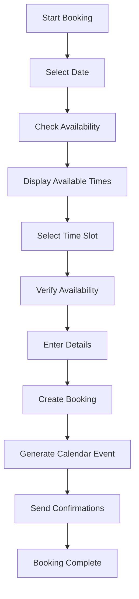
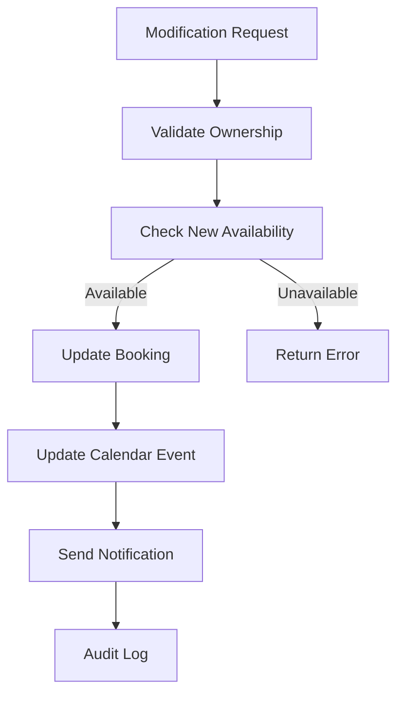
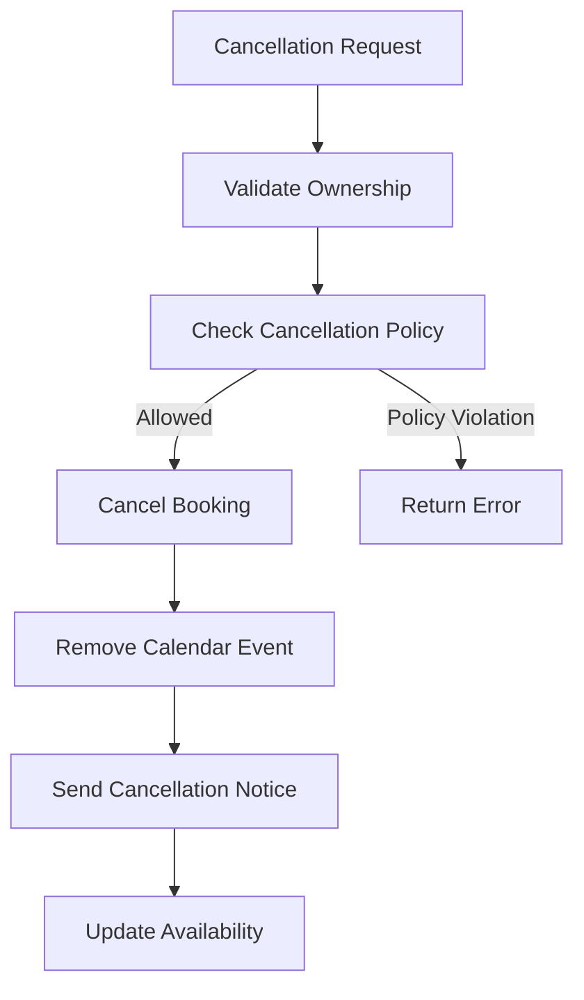

# Booking System Documentation

## Overview
The Lengolf Booking System is a comprehensive multi-step booking platform that allows customers to create, manage, and track golf bay reservations. Built with Next.js 14 and integrated with Google Calendar and CRM systems, it provides real-time availability checking, smart bay assignment, and seamless booking lifecycle management.

## 🎯 Core Features

### 1. Multi-Step Booking Creation
- **Step 1: Date Selection** - Interactive calendar with availability visualization
- **Step 2: Time Slot Selection** - Real-time availability checking and bay assignment
- **Step 3: Booking Details** - Customer information, party size, and special requests
- **Step 4: Confirmation** - Booking summary and automatic confirmations

### 2. Real-Time Availability System
- **Bay Coordination** - Multi-bay availability checking across all facilities
- **Calendar Integration** - Live sync with Google Calendar for accurate availability
- **Conflict Resolution** - Automatic detection and prevention of booking conflicts
- **Dynamic Pricing** - Support for variable pricing based on time and demand

### 3. Booking Management
- **Booking History** - Complete audit trail of all booking activities
- **Modification System** - Date, time, and duration changes with availability validation
- **Cancellation Process** - Instant cancellation with automated notifications
- **Guest Management** - Support for guest bookings and user account linking

### 4. Smart Bay Assignment & Bay Type System
- **Bay Type Differentiation** - Social Bays (1-3) for groups/beginners, AI Lab (Bay 4) for experienced players
- **Intelligent Bay Selection** - Algorithm considers group size, experience level, and bay type preferences
- **Capacity Optimization** - Efficient bay utilization across time slots with type-specific recommendations
- **Preference Handling** - Customer bay preferences and special requirements (left/right-handed optimization)
- **Real-time Updates** - Immediate reflection of availability changes across all bay types

#### Bay Types
- **Social Bays (Bay 1-3)**: Perfect for beginners, groups (3-5 players), casual experiences
- **LENGOLF AI Lab (Bay 4)**: Advanced AI swing analysis, dual-angle video replay, optimized for 1-2 experienced players

## 🏗️ Technical Architecture

### Frontend Components

#### Booking Flow Components
```typescript
// Multi-step booking components
app/(features)/bookings/components/
├── booking/
│   ├── Layout.tsx              // Main booking layout wrapper
│   ├── ConfirmationContent.tsx // Booking confirmation display
│   └── steps/
│       ├── DateSelection.tsx   // Date picker with availability
│       ├── TimeSlots.tsx       // Time slot selection interface
│       └── BookingDetails.tsx  // Customer details form
```

#### Custom Hooks
```typescript
// Booking-specific hooks
app/(features)/bookings/hooks/
├── useAvailability.ts    // Real-time availability checking
└── useBookingFlow.ts     // Booking flow state management
```

#### Type Definitions
```typescript
// Booking type definitions
app/(features)/bookings/types/
└── index.ts              // Complete booking type system
```

### Backend API Architecture

#### Core Booking APIs
```typescript
// Primary booking endpoints
/api/bookings/
├── create/              // POST - Create new booking
│   └── route.ts
└── calendar/            // Calendar integration
    └── create/          // POST - Create calendar event
        └── route.ts
```

#### Availability System
```typescript
// Availability checking endpoints
/api/availability/
├── route.ts             // GET - Check general availability
└── check/               // POST - Verify specific slot availability
    └── route.ts
```

## 📊 Booking Data Flow

### Booking Creation Process


### Data Sources Integration
1. **Booking Records** - Primary booking data in `bookings` table
2. **Calendar Events** - Google Calendar integration for bay scheduling
3. **Customer Data** - CRM integration for customer information
4. **Bay Configuration** - System configuration for bay availability
5. **Package Integration** - Package-based booking support

## 🎮 User Interface Design

### Booking Flow Layout
```tsx
<BookingLayout>
  <ProgressIndicator currentStep={step} />
  <StepContent>
    {step === 1 && <DateSelection />}
    {step === 2 && <TimeSlots />}
    {step === 3 && <BookingDetails />}
    {step === 4 && <ConfirmationContent />}
  </StepContent>
  <NavigationControls />
</BookingLayout>
```

### Step-by-Step Interface

#### Step 1: Date Selection
- **Calendar Widget** - Interactive date picker with availability indicators
- **Availability Visualization** - Color-coded availability status
- **Date Constraints** - Business hours and blackout date enforcement
- **Mobile Optimization** - Touch-friendly calendar interaction

#### Step 2: Time Slot Selection
- **Available Times** - Real-time slot availability display
- **Duration Options** - Multiple duration choices (1, 2, 3+ hours)
- **Bay Information** - Bay details and capacity information
- **Price Display** - Clear pricing for each time slot option

#### Step 3: Booking Details
- **Customer Information** - Name, contact details, and preferences
- **Party Size** - Number of players and equipment requirements
- **Special Requests** - Additional notes and special arrangements
- **Terms Acceptance** - Booking terms and cancellation policy

#### Step 4: Confirmation
- **Booking Summary** - Complete booking details review
- **Payment Information** - Payment processing and confirmation
- **Confirmation Details** - Booking reference and next steps
- **Calendar Integration** - Option to add to personal calendar

## 🔧 API Implementation Details

### Booking Creation API
```typescript
// POST /api/bookings/create
interface CreateBookingRequest {
  date: string;                    // YYYY-MM-DD format
  startTime: string;               // HH:mm format
  duration: number;                // Duration in hours
  bay?: string;                    // Optional bay preference
  customerName: string;            // Customer name
  customerEmail: string;           // Contact email
  customerPhone: string;           // Contact phone
  numberOfPeople: number;          // Party size
  specialRequests?: string;        // Additional notes
  packageId?: string;              // Package booking reference
}

interface CreateBookingResponse {
  success: boolean;
  bookingId: string;
  bookingReference: string;
  calendarEventId?: string;
  confirmationSent: boolean;
}
```

### Availability Checking API
```typescript
// GET /api/availability?date=2024-01-15
interface AvailabilityResponse {
  date: string;
  availableSlots: AvailabilitySlot[];
  fullyBooked: boolean;
}

interface AvailabilitySlot {
  startTime: string;               // HH:mm format
  endTime: string;                 // HH:mm format
  bay: string;                     // Bay identifier
  capacity: number;                // Maximum people
  price: number;                   // Slot price
  available: boolean;              // Availability status
}

// POST /api/availability/check
interface AvailabilityCheckRequest {
  date: string;
  startTime: string;
  duration: number;
  bay?: string;
}

interface AvailabilityCheckResponse {
  available: boolean;
  assignedBay?: string;
  conflictReason?: string;
  alternativeTimes?: string[];
}
```

## 🔄 Booking Lifecycle Management

### Booking States
```typescript
type BookingStatus = 
  | 'pending'      // Initial creation, awaiting confirmation
  | 'confirmed'    // Confirmed and scheduled
  | 'completed'    // Session completed
  | 'cancelled'    // Cancelled by customer or system
  | 'no-show'      // Customer did not show up
  | 'modified';    // Modified from original booking

interface BookingRecord {
  id: string;
  userId: string;
  bookingReference: string;
  date: string;
  startTime: string;
  duration: number;
  bay: string;
  status: BookingStatus;
  customerName: string;
  customerEmail: string;
  customerPhone: string;
  numberOfPeople: number;
  specialRequests?: string;
  packageId?: string;
  calendarEventId?: string;
  createdAt: string;
  updatedAt: string;
}
```

### Booking Modification Flow


### Cancellation Process


## 🗓️ Calendar Integration

### Google Calendar API Integration
```typescript
// Calendar service implementation
export class CalendarService {
  async createEvent(booking: BookingRecord): Promise<string> {
    const event = {
      summary: `Golf Booking - ${booking.customerName}`,
      start: {
        dateTime: this.formatDateTime(booking.date, booking.startTime),
        timeZone: 'Asia/Bangkok'
      },
      end: {
        dateTime: this.formatDateTime(booking.date, booking.endTime),
        timeZone: 'Asia/Bangkok'
      },
      description: this.formatEventDescription(booking),
      location: `Bay ${booking.bay}`,
      attendees: [
        { email: booking.customerEmail }
      ]
    };
    
    const response = await this.calendar.events.insert({
      calendarId: this.getBayCalendarId(booking.bay),
      resource: event
    });
    
    return response.data.id;
  }
  
  async updateEvent(eventId: string, booking: BookingRecord): Promise<void> {
    // Update existing calendar event
  }
  
  async deleteEvent(eventId: string, bay: string): Promise<void> {
    // Remove calendar event
  }
}
```

### Bay Calendar Management
- **Individual Bay Calendars** - Separate calendar for each bay
- **Master Calendar** - Combined view of all bay bookings
- **Availability Sync** - Real-time availability based on calendar events
- **Conflict Detection** - Automatic detection of scheduling conflicts

## 📱 Mobile-First Design

### Responsive Booking Interface
- **Touch-Optimized** - Large touch targets and gesture support
- **Progressive Enhancement** - Enhanced features for larger screens
- **Offline Capability** - Basic functionality when connection is poor
- **Performance Optimized** - Fast loading and smooth interactions

### Mobile-Specific Features
- **Date Picker** - Native mobile date picker integration
- **Time Selection** - Touch-friendly time slot selection
- **Form Optimization** - Minimal input requirements and validation
- **Quick Booking** - Streamlined flow for repeat customers

## 🔒 Security & Validation

### Input Validation
```typescript
// Zod schema for booking validation
import { z } from 'zod';

export const BookingSchema = z.object({
  date: z.string().regex(/^\d{4}-\d{2}-\d{2}$/),
  startTime: z.string().regex(/^\d{2}:\d{2}$/),
  duration: z.number().min(1).max(8),
  customerName: z.string().min(2).max(100),
  customerEmail: z.string().email(),
  customerPhone: z.string().min(10).max(15),
  numberOfPeople: z.number().min(1).max(8),
  specialRequests: z.string().max(500).optional()
});
```

### Authentication Integration
- **Guest Bookings** - Allow bookings without account registration
- **Account Linking** - Option to link guest bookings to accounts
- **Authentication Required** - VIP features require authentication
- **Session Management** - Secure session handling for logged-in users

### Rate Limiting
```typescript
// Rate limiting configuration
const BOOKING_RATE_LIMITS = {
  guestBookings: 3,        // Per hour
  authenticatedBookings: 10, // Per hour
  availabilityChecks: 100   // Per minute
};
```

## 📊 Performance Optimization

### Caching Strategy
```typescript
// Availability caching configuration
const AVAILABILITY_CACHE = {
  ttl: 300,                // 5 minutes
  strategy: 'time-based',  // Time-based invalidation
  granularity: 'hourly'    // Hourly cache buckets
};
```

### Database Optimization
- **Indexed Queries** - Optimized database indexes for availability queries
- **Connection Pooling** - Efficient database connection management
- **Query Optimization** - Optimized SQL queries for booking operations
- **Read Replicas** - Separate read operations for better performance

### Frontend Performance
- **Code Splitting** - Lazy loading of booking components
- **Image Optimization** - Optimized images for calendar and UI
- **Bundle Optimization** - Minimized JavaScript bundle size
- **CDN Integration** - Fast asset delivery via CDN

## 🧪 Testing Strategy

### Unit Testing
```typescript
// Example booking component test
describe('BookingCreation', () => {
  it('should validate required fields', () => {
    const result = BookingSchema.safeParse({
      date: '2024-01-15',
      startTime: '14:00',
      // Missing required fields
    });
    expect(result.success).toBe(false);
  });
  
  it('should create booking with valid data', async () => {
    const bookingData = createValidBookingData();
    const result = await createBooking(bookingData);
    expect(result.success).toBe(true);
    expect(result.bookingId).toBeDefined();
  });
});
```

### Integration Testing
- **API Testing** - Complete API endpoint testing
- **Calendar Integration** - Google Calendar API integration tests
- **Availability Testing** - Real-time availability checking tests
- **End-to-End Testing** - Complete booking flow testing

### Performance Testing
- **Load Testing** - High-concurrency booking scenarios
- **Availability Testing** - Stress testing of availability system
- **Response Time Testing** - API response time benchmarking
- **Mobile Performance** - Mobile device performance testing

## 🚀 Deployment & Monitoring

### Environment Configuration
```bash
# Booking system environment variables
GOOGLE_CALENDAR_ID=your-calendar-id
BAY_CALENDARS='{"bay1":"cal-id-1","bay2":"cal-id-2"}'
BOOKING_CONFIRMATION_EMAIL=bookings@len.golf
DEFAULT_BOOKING_DURATION=2
MAX_ADVANCE_BOOKING_DAYS=30
```

### Monitoring & Analytics
- **Booking Metrics** - Booking conversion rates and abandonment tracking
- **Performance Monitoring** - API response time and error rate tracking
- **Availability Analytics** - Bay utilization and popular time analysis
- **User Behavior** - Booking flow analytics and optimization insights

### Error Handling & Recovery
- **Graceful Degradation** - Fallback options when services are unavailable
- **Retry Mechanisms** - Automatic retry for transient failures
- **Error Logging** - Comprehensive error tracking and alerting
- **Recovery Procedures** - Documented procedures for system recovery

## 📈 Recent Updates (January 2025)

### Bay Type System Implementation
- **Bay Differentiation**: Implemented Social Bays vs AI Lab distinction with appropriate user guidance
- **Mobile UX Improvements**: Redesigned bay selection filter for better mobile responsiveness
- **Form Validation**: Enhanced booking form to require bay type selection before submission
- **Visual Consistency**: Updated confirmation displays with compact card layout instead of prominent banners

### Email & Notification Enhancements
- **SSL Certificate Handling**: Resolved email delivery issues with proper hostname configuration
- **Content Optimization**: Removed duplicate golf club rental information from email templates
- **Pricing Clarity**: Distinguished between complimentary Standard Set and premium club rentals
- **LINE Integration**: Fixed bay naming consistency in LINE notifications (Bay 4 vs LENGOLF AI Lab)

### User Experience Improvements
- **Default Selections**: Set Standard Set as default golf club rental choice
- **Image Support**: Added proper bay type images with fallback handling
- **Responsive Design**: Improved mobile layouts for time selection and bay filtering
- **Form Flow**: Enhanced booking details form with better section organization

### Technical Optimizations
- **Type Safety**: Fixed TypeScript issues across booking components
- **Data Processing**: Improved customer notes handling to prevent duplication
- **State Management**: Enhanced booking flow with proper default values
- **Error Handling**: Added comprehensive validation for all booking steps

## 🔮 Future Enhancements

### Planned Features
- **Recurring Bookings** - Support for weekly/monthly recurring reservations
- **Group Bookings** - Large group booking management
- **Equipment Rental** - Integrated equipment rental booking
- **Dynamic Pricing** - Real-time pricing based on demand
- **Waitlist System** - Automatic booking when slots become available

### Technical Improvements
- **Real-time Updates** - WebSocket integration for live availability
- **Advanced Analytics** - Machine learning for demand prediction
- **Mobile App** - Native mobile application
- **API Expansion** - Extended API for third-party integrations

This comprehensive booking system provides a robust, scalable platform for golf bay reservations while maintaining excellent user experience and system reliability. 