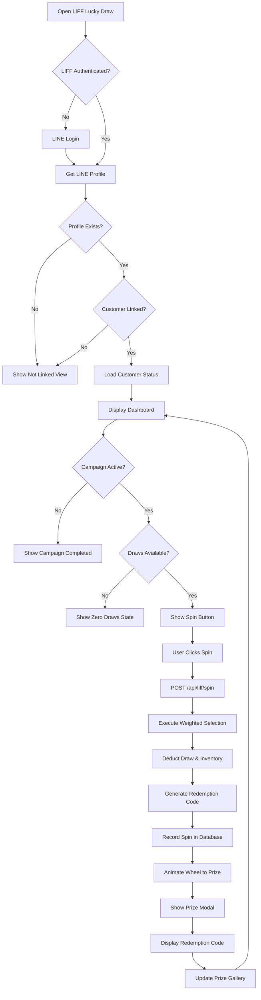
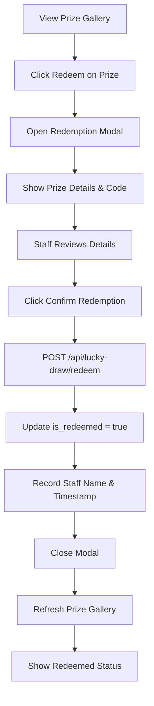

# Lucky Draw System Documentation

## Overview
The LENGOLF Lucky Draw System is a transaction-based promotional campaign that rewards customers with prize draws based on their purchase amounts. Integrated within the LINE LIFF ecosystem, the system provides an engaging, gamified experience while tracking customer spending and prize distribution. Built with Next.js 14, Supabase PostgreSQL, and LINE LIFF SDK.

## 🎯 Core Features

### 1. Transaction-Based Rewards
- **Automatic Draw Awards**: Customers earn 1 draw per transaction over 500 THB
- **Real-time Processing**: Instant draw credits after qualified purchases
- **POS Integration**: Seamless integration with existing transaction system
- **Draw Tracking**: Complete history of earned and used draws

### 2. Interactive Spin Wheel
- **Dynamic Prize Loading**: Real-time prize availability from database
- **Weighted Random Selection**: Prize probability based on inventory quantity
- **Smooth Animation**: 4-second spin animation with cubic-bezier easing
- **Brand Integration**: LENGOLF logo centered in wheel design
- **Visual Feedback**: Color-coded prize segments with clear labels

### 3. Prize Management
- **11 Prize Types**: Golf bags, packages, vouchers, accessories
- **208 Total Prizes**: Distributed across different value tiers
- **Real-time Inventory**: Automatic inventory deduction on wins
- **Redemption Codes**: Unique codes generated for each prize
- **Prize Gallery**: Visual display of won prizes with redemption status

### 4. Campaign Management
- **Active Campaign Tracking**: Monitor prize availability in real-time
- **Campaign Status**: Active/inactive states with automatic checks
- **Prize Breakdown**: Detailed inventory and distribution analytics
- **Campaign Completion**: Graceful handling when all prizes claimed

### 5. Staff Redemption System
- **Simple Redemption Flow**: One-button confirmation process
- **Redemption Tracking**: Staff name and timestamp recording
- **Prize Verification**: Display prize details and redemption code
- **Status Updates**: Immediate UI updates after redemption

## 🚀 Access Methods

### LINE LIFF Access
- **LIFF URL**: `https://liff.line.me/2007027277-0rZoJ1nw/liff/lucky-draw`
- **Authentication**: LINE Login with profile access
- **Account Linking**: Required connection to customer profile
- **Rich Menu Integration**: Accessible via LINE Rich Menu

### Development Testing
- **Dev Mode URL**: `http://localhost:3000/liff/lucky-draw?dev=true&customerId={uuid}`
- **No LIFF SDK Required**: Bypass LINE authentication for testing
- **Full Feature Access**: Test all functionality without LINE app

## 🔐 Authentication & Security

### LINE Authentication
```typescript
// LIFF initialization with authentication
await window.liff.init({ liffId: process.env.NEXT_PUBLIC_LIFF_ID });

if (!window.liff.isLoggedIn()) {
  window.liff.login({ redirectUri: window.location.href });
}

const profile = await window.liff.getProfile();
// Use profile.userId to link with customer account
```

### Account Linking Requirements
- **Profile Creation**: LINE profile must exist in database
- **Customer Linkage**: Profile must be linked to customer_id
- **Access Control**: Only linked customers can participate
- **Data Privacy**: Customer data protected by RLS policies

## 🏗️ Technical Architecture

### Frontend Components

#### LIFF Components
```typescript
// Lucky Draw component structure
app/liff/lucky-draw/
└── page.tsx                  // Main lucky draw page with state management

components/liff/
├── DrawCounter.tsx           // Display available draws and spin button
├── SpinWheel.tsx            // Animated wheel with dynamic prizes
├── PrizeModal.tsx           // Prize reveal modal with confetti
├── PrizeGallery.tsx         // Display won prizes history
├── StaffRedemptionModal.tsx // Prize redemption confirmation
└── NotLinkedView.tsx        // Account linking prompt
```

#### Component Responsibilities

**DrawCounter.tsx**
- Displays available draw count
- Shows campaign status (active/completed)
- Provides spin action button
- Handles zero-draw state messaging

**SpinWheel.tsx**
- Fetches available prizes from database
- Renders SVG wheel with dynamic segments
- Animates wheel rotation to winning segment
- Calculates prize position and rotation angle
- Integrates LENGOLF logo in center

**PrizeModal.tsx**
- Displays prize win/loss results
- Shows redemption code for winners
- Confetti animation for winning prizes
- Share functionality via LINE API
- Venue and contact information

**PrizeGallery.tsx**
- Lists all won prizes chronologically
- Shows redemption status (redeemed/pending)
- Displays redemption codes
- Provides redeem button for unredeemed prizes

**StaffRedemptionModal.tsx**
- Single-button redemption confirmation
- Prize details and code display
- Error handling for redemption failures
- Loading states during processing

### Backend API Endpoints

#### Lucky Draw APIs
```typescript
// API endpoints for lucky draw system
/api/lucky-draw/
├── campaign-status        // GET - Campaign info and prize breakdown
├── customer-status        // GET - Customer draws and prizes
└── redeem                // POST - Redeem won prize

/api/liff/
└── spin                  // POST - Execute spin and award prize
```

#### Endpoint Details

**GET /api/lucky-draw/campaign-status**
```typescript
interface CampaignStatusResponse {
  totalPrizes: number;
  prizesRemaining: number;
  prizesAwarded: number;
  campaignActive: boolean;
  prizeBreakdown: Array<{
    prize_name: string;
    initial_quantity: number;
    remaining: number;
    awarded: number;
  }>;
}
```

**GET /api/lucky-draw/customer-status**
```typescript
interface CustomerStatusResponse {
  draws_available: number;
  campaignActive: boolean;
  prizes: Array<{
    id: string;
    prize_name: string;
    prize_description: string;
    redemption_code: string;
    spin_timestamp: string;
    is_redeemed: boolean;
    redeemed_at: string | null;
    redeemed_by_staff_name: string | null;
    draw_sequence: number;
  }>;
}
```

**POST /api/liff/spin**
```typescript
interface SpinRequest {
  customerId: string;
  lineUserId: string;
}

interface SpinResponse {
  success: true;
  prize: string;
  prizeDescription: string;
  redemptionCode: string;
  drawsRemaining: number;
}
```

**POST /api/lucky-draw/redeem**
```typescript
interface RedeemRequest {
  prizeId: string;
  staffName: string;
}

interface RedeemResponse {
  success: true;
  message: string;
}
```

### Database Schema

#### Core Tables

**prize_inventory**
```sql
CREATE TABLE prize_inventory (
  id UUID PRIMARY KEY DEFAULT uuid_generate_v4(),
  prize_name VARCHAR(255) NOT NULL,
  prize_description TEXT,
  prize_value_thb NUMERIC(10, 2),
  initial_quantity INTEGER NOT NULL,
  remaining_quantity INTEGER NOT NULL,
  is_active BOOLEAN DEFAULT true,
  created_at TIMESTAMPTZ DEFAULT NOW(),
  updated_at TIMESTAMPTZ DEFAULT NOW()
);
```

**lucky_draw_spins**
```sql
CREATE TABLE lucky_draw_spins (
  id UUID PRIMARY KEY DEFAULT uuid_generate_v4(),
  customer_id UUID REFERENCES customers(id),
  line_user_id VARCHAR(255),
  phone_number VARCHAR(20),  -- Nullable for users without phone
  display_name VARCHAR(255),
  prize_id UUID REFERENCES prize_inventory(id),
  prize_name VARCHAR(255) NOT NULL,
  prize_description TEXT,
  redemption_code VARCHAR(20) UNIQUE NOT NULL,
  spin_timestamp TIMESTAMPTZ DEFAULT NOW(),
  is_redeemed BOOLEAN DEFAULT false,
  redeemed_at TIMESTAMPTZ,
  redeemed_by_staff_name VARCHAR(255),
  draw_sequence INTEGER NOT NULL
);
```

**lucky_draw_transactions**
```sql
CREATE TABLE lucky_draw_transactions (
  id UUID PRIMARY KEY DEFAULT uuid_generate_v4(),
  customer_id UUID REFERENCES customers(id),
  transaction_id VARCHAR(255) UNIQUE,
  transaction_amount NUMERIC(10, 2) NOT NULL,
  draws_awarded INTEGER NOT NULL,
  transaction_timestamp TIMESTAMPTZ DEFAULT NOW(),
  processed_by VARCHAR(255)
);
```

### Database Functions

#### Weighted Prize Selection
```sql
CREATE OR REPLACE FUNCTION select_prize_weighted()
RETURNS TABLE (
  prize_id UUID,
  prize_name VARCHAR,
  prize_description TEXT,
  remaining_quantity INTEGER
) AS $$
DECLARE
  total_weight INTEGER;
  random_value NUMERIC;
  running_total INTEGER := 0;
  selected_prize RECORD;
BEGIN
  -- Calculate total weight (sum of remaining quantities)
  SELECT SUM(remaining_quantity)::INTEGER INTO total_weight
  FROM prize_inventory
  WHERE is_active = true AND remaining_quantity > 0;

  -- Generate random value between 0 and total_weight
  random_value := random() * total_weight;

  -- Find winning prize using weighted selection
  FOR selected_prize IN
    SELECT * FROM prize_inventory
    WHERE is_active = true AND remaining_quantity > 0
    ORDER BY prize_value_thb DESC
  LOOP
    running_total := running_total + selected_prize.remaining_quantity;
    IF running_total >= random_value THEN
      -- Decrement inventory
      UPDATE prize_inventory
      SET remaining_quantity = remaining_quantity - 1
      WHERE id = selected_prize.id;

      RETURN QUERY SELECT
        selected_prize.id,
        selected_prize.prize_name,
        selected_prize.prize_description,
        selected_prize.remaining_quantity - 1;
      RETURN;
    END IF;
  END LOOP;
END;
$$ LANGUAGE plpgsql;
```

#### Campaign Status Check
```sql
CREATE OR REPLACE FUNCTION get_campaign_status()
RETURNS TABLE (
  total_prizes INTEGER,
  prizes_remaining INTEGER,
  prizes_awarded INTEGER,
  is_active BOOLEAN,
  prize_breakdown JSONB
) AS $$
BEGIN
  RETURN QUERY
  SELECT
    SUM(pi.initial_quantity)::INTEGER as total_prizes,
    SUM(pi.remaining_quantity)::INTEGER as prizes_remaining,
    SUM(pi.initial_quantity - pi.remaining_quantity)::INTEGER as prizes_awarded,
    EXISTS(SELECT 1 FROM prize_inventory pi2 WHERE pi2.is_active = true AND pi2.remaining_quantity > 0) as is_active,
    jsonb_agg(
      jsonb_build_object(
        'prize_name', pi.prize_name,
        'initial_quantity', pi.initial_quantity,
        'remaining', pi.remaining_quantity,
        'awarded', pi.initial_quantity - pi.remaining_quantity
      )
    ) as prize_breakdown
  FROM prize_inventory pi;
END;
$$ LANGUAGE plpgsql;
```

#### Draw Availability Check
```sql
CREATE OR REPLACE FUNCTION get_customer_draws(p_customer_id UUID)
RETURNS INTEGER AS $$
DECLARE
  total_earned INTEGER;
  total_used INTEGER;
BEGIN
  -- Calculate draws earned from transactions
  SELECT COALESCE(SUM(draws_awarded), 0)::INTEGER INTO total_earned
  FROM lucky_draw_transactions
  WHERE customer_id = p_customer_id;

  -- Calculate draws used from spins
  SELECT COUNT(*)::INTEGER INTO total_used
  FROM lucky_draw_spins
  WHERE customer_id = p_customer_id;

  RETURN total_earned - total_used;
END;
$$ LANGUAGE plpgsql;
```

## 🎨 UI/UX Design System

### Brand Colors
```typescript
// LENGOLF brand color palette
const BRAND_COLORS = {
  primary: '#005a32',      // Dark green (primary brand)
  hover: '#004225',        // Darker green (hover states)
  background: '#f5fef9',   // Light green tint (page background)
  accent: '#2b6f36',       // Medium green (accents)
};

// Wheel prize colors (alternating greens)
const PRIZE_COLORS = [
  '#005a32', '#2b6f36', '#3d8b4a', '#006a3b',
  '#4caf50', '#1b5e20', '#2e7d32', '#388e3c',
  '#43a047', '#66bb6a', '#81c784'
];
```

### Design Principles
- **Minimal & Clean**: No excessive emojis or decorations
- **Professional**: Aligned with LENGOLF brand identity
- **Clear Hierarchy**: Bold headings, readable body text
- **Flat Design**: Subtle shadows, no gradients
- **Consistent Spacing**: 8px grid system with Tailwind utilities
- **Accessible**: WCAG 2.1 AA compliant contrast ratios

### Typography Scale
```typescript
// Text hierarchy
h1: 'text-3xl font-bold'        // 30px, Page titles
h2: 'text-2xl font-bold'        // 24px, Section titles
h3: 'text-xl font-bold'         // 20px, Card titles
body: 'text-sm'                 // 14px, Body text
caption: 'text-xs'              // 12px, Helper text
```

### Interactive States
```typescript
// Button states
default: 'bg-[#005a32] text-white'
hover: 'hover:bg-[#004225]'
disabled: 'disabled:opacity-50 disabled:cursor-not-allowed'
loading: 'opacity-70 cursor-wait'

// Transition speeds
fast: 'transition-all duration-200'
normal: 'transition-all duration-300'
spin: 'transition: transform 4s cubic-bezier(0.17, 0.67, 0.12, 0.99)'
```

## 🔄 User Flow Documentation

### Complete User Journey


### Redemption Flow


### Transaction Processing Flow
```mermaid
graph TD
    A[POS Transaction Completed] --> B{Amount > 500 THB?}
    B -->|No| C[No Draw Awarded]
    B -->|Yes| D[Calculate Draws: floor(amount/500)]
    D --> E[Insert into lucky_draw_transactions]
    E --> F[Record draws_awarded]
    F --> G[Customer Sees Updated Draw Count]
    G --> H[Customer Can Spin]
```

## 📊 Prize Distribution & Probabilities

### Prize Inventory (208 Total)
```typescript
const PRIZE_BREAKDOWN = [
  { name: 'Golf Hat', quantity: 40, value: 800, probability: '19.23%' },
  { name: 'Golf Marker', quantity: 35, value: 500, probability: '16.83%' },
  { name: 'Golf Gloves', quantity: 30, value: 1200, probability: '14.42%' },
  { name: 'Golf Balls', quantity: 25, value: 1000, probability: '12.02%' },
  { name: '20% Discount', quantity: 20, value: 'varies', probability: '9.62%' },
  { name: 'Premium Tumbler', quantity: 18, value: 1500, probability: '8.65%' },
  { name: '1-Hour Bay Voucher', quantity: 15, value: 3000, probability: '7.21%' },
  { name: '2-Hour Bay Voucher', quantity: 10, value: 6000, probability: '4.81%' },
  { name: 'Bronze Package', quantity: 8, value: 20000, probability: '3.85%' },
  { name: 'Silver Package', quantity: 6, value: 30000, probability: '2.88%' },
  { name: 'Golf Bag', quantity: 1, value: 8000, probability: '0.48%' }
];
```

### Weighted Random Algorithm
The system uses remaining inventory quantity as weight for probability:
- More available prizes = higher chance of winning
- As prizes are won, their probability automatically decreases
- Ensures fair distribution across all prize tiers
- High-value prizes have naturally lower probability due to lower quantity

### Campaign Economics
```typescript
const CAMPAIGN_METRICS = {
  totalPrizes: 208,
  totalRetailValue: 500000,  // Approximate THB
  averagePrizeValue: 2400,   // THB per prize
  expectedParticipants: 300,
  spinsPerCustomer: 5,       // Average estimate
  totalExpectedSpins: 1500,
  winRate: 13.87             // 208/1500 = 13.87% win rate
};
```

## 🔧 Development Guidelines

### Adding New Prizes
```sql
-- Add new prize to inventory
INSERT INTO prize_inventory (
  prize_name,
  prize_description,
  prize_value_thb,
  initial_quantity,
  remaining_quantity,
  is_active
) VALUES (
  'New Prize Name',
  'Prize description for display',
  5000.00,
  10,
  10,
  true
);
```

### Awarding Manual Draws
```sql
-- Admin function to award draws manually
CREATE OR REPLACE FUNCTION admin_award_draws(
  p_customer_id UUID,
  p_draws INTEGER,
  p_reason TEXT
)
RETURNS void AS $$
BEGIN
  INSERT INTO lucky_draw_transactions (
    customer_id,
    transaction_id,
    transaction_amount,
    draws_awarded,
    processed_by
  ) VALUES (
    p_customer_id,
    'MANUAL-' || gen_random_uuid()::TEXT,
    0,
    p_draws,
    p_reason
  );
END;
$$ LANGUAGE plpgsql;

-- Usage: Award 5 draws to customer
SELECT admin_award_draws(
  '07566f42-dfcd-4230-aa8e-ef8e00125739'::UUID,
  5,
  'Promotional award'
);
```

### Testing Spin Wheel Locally
```typescript
// Development mode URL pattern
const DEV_URL = 'http://localhost:3000/liff/lucky-draw?dev=true&customerId={uuid}&name={name}';

// Example test URL
const TEST_URL = 'http://localhost:3000/liff/lucky-draw?dev=true&customerId=07566f42-dfcd-4230-aa8e-ef8e00125739&name=David%20G.';

// Bypasses LIFF authentication
// Directly loads customer data
// Full functionality available
```

### Error Handling Patterns
```typescript
// API error handling
try {
  const response = await fetch('/api/liff/spin', {
    method: 'POST',
    headers: { 'Content-Type': 'application/json' },
    body: JSON.stringify({ customerId, lineUserId })
  });

  const data = await response.json();

  if (!response.ok) {
    throw new Error(data.error || 'Failed to spin');
  }

  // Handle success
} catch (err) {
  console.error('[spin] Error:', err);
  setError(err instanceof Error ? err.message : 'An error occurred');
  setIsSpinning(false);
}
```

## 📱 LINE Integration Details

### LIFF SDK Initialization
```typescript
// Initialize LIFF with error handling
const liffId = process.env.NEXT_PUBLIC_LIFF_ID;

await window.liff.init({ liffId }).catch((err) => {
  if (err.message.includes('channel not found')) {
    throw new Error('Invalid LIFF ID. Please verify configuration.');
  }
  throw err;
});

// Check authentication status
if (!window.liff.isLoggedIn()) {
  window.liff.login({ redirectUri: window.location.href });
  return;
}

// Get user profile
const profile = await window.liff.getProfile();
// profile.userId, profile.displayName, profile.pictureUrl
```

### LIFF Configuration
```env
# .env.local
NEXT_PUBLIC_LIFF_ID=2007027277-0rZoJ1nw
```

### Share Target Picker Integration
```typescript
// Share prize win on LINE
const handleShare = () => {
  if (window.liff?.isApiAvailable('shareTargetPicker')) {
    window.liff.shareTargetPicker([
      {
        type: 'text',
        text: `I just won "${prize}" from LENGOLF Lucky Draw! 🎉\nTry your luck at: ${window.location.href}`
      }
    ]).catch((err) => {
      console.error('Failed to share:', err);
    });
  }
};
```

## 🔧 Security & Privacy

### Data Access Control
```typescript
// Only allow customer to access their own data
const { data: profile } = await supabase
  .from('profiles')
  .select('customer_id')
  .eq('provider', 'line')
  .eq('provider_id', lineUserId)
  .single();

if (!profile?.customer_id) {
  return NextResponse.json(
    { error: 'Customer not linked' },
    { status: 403 }
  );
}

// Use customer_id for all subsequent queries
const { data: draws } = await supabase
  .from('lucky_draw_transactions')
  .select('*')
  .eq('customer_id', profile.customer_id);
```

### Redemption Code Generation
```typescript
// Generate unique redemption codes
function generateRedemptionCode(): string {
  const prefix = 'LG';  // LENGOLF prefix
  const random = Math.random().toString(36).substring(2, 10).toUpperCase();
  return `${prefix}${random}`;  // e.g., LG8A4K9X2M
}

// Ensure uniqueness with database constraint
// UNIQUE constraint on redemption_code column
```

### Fraud Prevention
- **One Spin Per Draw**: Each draw can only be used once
- **Inventory Validation**: Cannot win prizes with 0 inventory
- **Transaction Verification**: Draws only from verified POS transactions
- **Redemption Tracking**: Unique codes with staff verification
- **Audit Trail**: Complete logging of all spins and redemptions

## 📊 Performance Optimization

### Database Indexing
```sql
-- Performance indexes
CREATE INDEX idx_lucky_draw_spins_customer_id ON lucky_draw_spins(customer_id);
CREATE INDEX idx_lucky_draw_spins_line_user_id ON lucky_draw_spins(line_user_id);
CREATE INDEX idx_lucky_draw_spins_redemption_code ON lucky_draw_spins(redemption_code);
CREATE INDEX idx_lucky_draw_spins_is_redeemed ON lucky_draw_spins(is_redeemed);
CREATE INDEX idx_lucky_draw_transactions_customer_id ON lucky_draw_transactions(customer_id);
CREATE INDEX idx_prize_inventory_is_active ON prize_inventory(is_active, remaining_quantity);
```

### Caching Strategy
```typescript
// No aggressive caching for real-time accuracy
// Always fetch latest draws and inventory
// Prize modal shows immediate updates
// Gallery refreshes after each spin
```

### API Performance Targets
```typescript
const PERFORMANCE_TARGETS = {
  spin: '<1000ms',              // Spin operation including DB writes
  customerStatus: '<300ms',     // Get customer draws and prizes
  campaignStatus: '<200ms',     // Get campaign statistics
  redemption: '<500ms'          // Process redemption
};
```

## 🚀 Deployment Checklist

### Pre-Launch Verification
- [ ] All 208 prizes loaded into prize_inventory table
- [ ] Database functions deployed and tested (select_prize_weighted, get_campaign_status, get_customer_draws)
- [ ] LIFF app registered and NEXT_PUBLIC_LIFF_ID configured
- [ ] LINE Rich Menu configured with lucky draw link
- [ ] Database indexes created for performance
- [ ] Phone number column made nullable (migration applied)
- [ ] Logo image available at /public/images/lengolf_logo.jpg
- [ ] POS system integrated for transaction-based draw awards
- [ ] Staff trained on redemption process

### Environment Configuration
```bash
# Required environment variables
NEXT_PUBLIC_LIFF_ID=2007027277-0rZoJ1nw
NEXT_PUBLIC_SUPABASE_URL=your_supabase_url
NEXT_PUBLIC_SUPABASE_ANON_KEY=your_anon_key
SUPABASE_SERVICE_ROLE_KEY=your_service_role_key
```

### Monitoring Setup
```typescript
// Key metrics to monitor
const MONITORING_METRICS = {
  totalSpins: 'Count of lucky_draw_spins records',
  prizesAwon: 'Count where prize_name != "Better Luck Next Time"',
  redemptionRate: 'is_redeemed = true / total prizes won',
  drawsEarned: 'Sum of draws_awarded from transactions',
  drawsUsed: 'Count of lucky_draw_spins',
  inventoryLevels: 'remaining_quantity by prize type'
};
```

## 🔮 Future Enhancements

### Planned Features
- **Push Notifications**: Alert customers when new draws are earned
- **Leaderboard**: Show top winners and most active participants
- **Social Sharing**: Enhanced sharing with images and rich content
- **Prize Tiers**: VIP customers get bonus draws or better odds
- **Time-Limited Bonuses**: Happy hour draws or weekend multipliers
- **Referral Rewards**: Earn draws by referring friends

### Technical Improvements
- **Real-time Updates**: WebSocket for live inventory updates
- **Advanced Analytics**: Customer engagement and conversion tracking
- **A/B Testing**: Test different prize distributions and UI variations
- **Multi-Language**: Support Thai and English languages
- **Progressive Web App**: Offline support for better UX

### Business Enhancements
- **Seasonal Campaigns**: Special holiday or event-based prizes
- **Tiered Campaigns**: Different campaigns for different customer segments
- **Partner Integration**: Cross-promotion with partner brands
- **Dynamic Pricing**: Adjust minimum transaction amount dynamically

## 📚 Related Documentation
- [VIP Customer Portal](./VIP_CUSTOMER_PORTAL.md) - VIP system integration
- [API Reference](../api/API_REFERENCE.md) - Complete API documentation
- [Project Structure](../technical/PROJECT_STRUCTURE.md) - Codebase organization

## 🆘 Troubleshooting

### Common Issues

**Issue: "Customer not linked" error**
- Cause: LINE profile not connected to customer_id
- Solution: Ensure profile exists in profiles table with valid customer_id

**Issue: "No prizes available" during spin**
- Cause: All prizes in inventory claimed
- Solution: Check campaign status, consider adding more prizes or ending campaign

**Issue: "Phone number constraint violation"**
- Cause: Old schema had NOT NULL constraint
- Solution: Migration applied to make phone_number nullable

**Issue: Wheel shows old hardcoded prizes**
- Cause: Not fetching from database dynamically
- Solution: Verify SpinWheel.tsx uses useEffect to fetch from /api/lucky-draw/campaign-status

**Issue: Confetti blocks view after prize reveal**
- Cause: Animation doesn't fade out
- Solution: Verify keyframe animation fades opacity to 0 at 90-100%

---

**Last Updated**: November 20, 2025
**Version**: 1.0
**Status**: Production Ready
