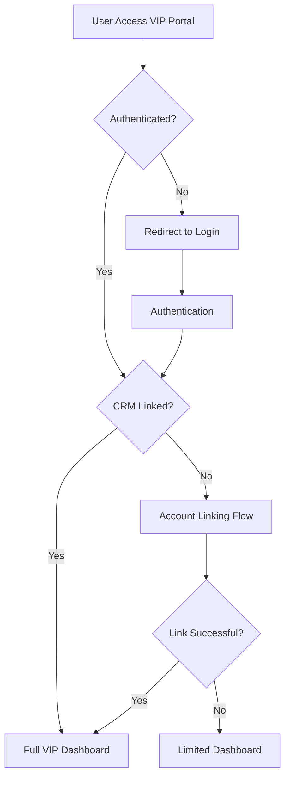
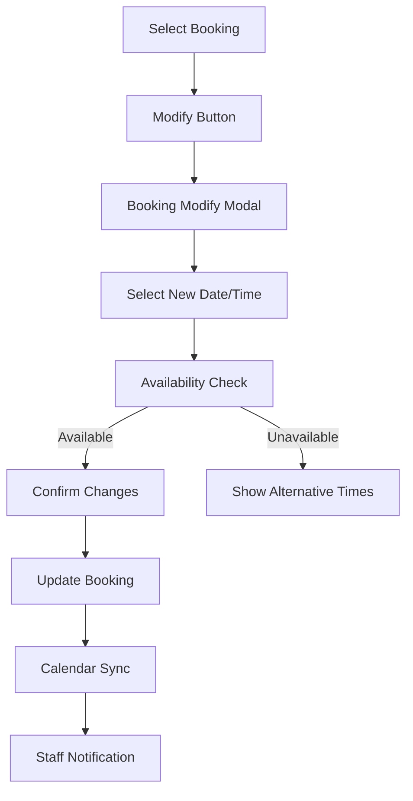

# VIP Customer Portal Documentation

## Overview
The VIP Customer Portal is a comprehensive self-service platform that allows customers to manage their golf bookings, view package information, update profile details, and access their booking history. Built as part of the Lengolf Booking Refactor system, it provides a modern, responsive interface accessible both via web browser and designed for future LINE LIFF integration.

## 🎯 Core Features

### 1. Profile Management
- **Personal Information**: Update name, email, and contact details
- **Marketing Preferences**: Control notification and marketing communications
- **VIP Tier Display**: View current membership tier and benefits
- **Account Linking**: Connect web account with CRM customer records

### 2. Booking Management
- **Booking History**: Complete view of past and upcoming reservations
- **Booking Modifications**: Self-service date, time, and duration changes
- **Booking Cancellations**: Instant cancellation with automated notifications
- **Real-time Updates**: Immediate reflection of changes across all systems

### 3. Package Tracking
- **Active Packages**: View current packages with usage tracking
- **Package History**: Complete record of past packages
- **Usage Analytics**: Detailed breakdown of package utilization
- **Expiration Monitoring**: Alerts for packages nearing expiration

### 4. Account Integration
- **Automatic Linking**: Smart matching with existing CRM records
- **Manual Linking**: Phone-based verification for account connection
- **Data Synchronization**: Real-time sync with CRM and booking systems
- **Profile Merging**: Seamless integration of web and CRM data

## 🚀 Access Methods

### Web Browser Access
- **Direct URL**: `https://len.golf/vip`
- **Responsive Design**: Optimized for desktop, tablet, and mobile
- **Authentication**: Secure login via Google, Facebook, or guest accounts
- **Session Management**: Persistent sessions with automatic renewal

### LINE Integration (Ready)
- **LIFF Integration**: Ready for deployment within LINE app
- **Rich Menu**: Designed for LINE Rich Menu navigation
- **Native Experience**: Seamless in-app user experience
- **Notification Integration**: Connected to LINE messaging system

## 🔐 Authentication & Security

### Multi-Provider Authentication
```typescript
// Supported authentication providers
const providers = [
  'google',     // Google OAuth
  'facebook',   // Facebook OAuth
  'line',       // LINE Login (ready)
  'guest'       // Guest registration
];
```

### Security Features
- **Row Level Security**: Database-level access control
- **JWT Sessions**: Secure token-based authentication
- **Rate Limiting**: Protection against abuse
- **Input Validation**: Comprehensive form validation
- **CSRF Protection**: Built-in cross-site request forgery protection

## 🏗️ Technical Architecture

### Frontend Components

#### Core VIP Components
```typescript
// Main VIP components structure
components/vip/
├── DashboardView.tsx        // Main dashboard with summary cards
├── ProfileView.tsx          // Profile management interface
├── BookingsList.tsx         // Booking history and management
├── PackagesList.tsx         // Package tracking interface
├── MembershipTiers.tsx      // VIP tier information
└── ManualLinkAccountForm.tsx // Account linking interface
```

#### Modal Components
```typescript
// Interactive modal components
├── BookingModifyModal.tsx   // Booking modification interface
├── BookingCancelModal.tsx   // Booking cancellation confirmation
└── LinkAccountPrompt.tsx    // Account linking prompt
```

#### Utility Components
```typescript
// Supporting utility components
├── DashboardCard.tsx        // Dashboard summary cards
├── SummaryCard.tsx         // Information summary display
└── EmptyState.tsx          // Empty state messaging
```

### Backend API Endpoints

#### VIP-Specific APIs
```typescript
// API endpoints for VIP functionality
/api/vip/
├── status           // GET - Check VIP account status
├── profile          // GET/PUT - Profile management
├── bookings         // GET - Booking history
├── packages         // GET - Package information
└── link-account     // POST - Manual account linking
```

#### Booking Management APIs
```typescript
// Booking modification endpoints
/api/vip/bookings/[bookingId]/
├── modify          // PUT - Modify booking details
└── cancel          // POST - Cancel booking
```

## 📱 User Interface Design

### Dashboard Layout
```tsx
<VipLayout>
  <DashboardView>
    <SummaryCards />
    <QuickActions />
    <RecentActivity />
    <PackageStatus />
  </DashboardView>
</VipLayout>
```

### Navigation Structure
- **Dashboard**: Overview and quick actions
- **Profile**: Personal information management
- **Bookings**: Booking history and management
- **Packages**: Package tracking and usage
- **Membership**: VIP tier information

### Responsive Design
- **Mobile First**: Optimized for mobile devices
- **Touch Friendly**: Large touch targets and gestures
- **Progressive Enhancement**: Enhanced features for larger screens
- **Accessibility**: WCAG 2.1 AA compliant

## 🔄 User Flow Documentation

### Initial Access Flow


### Account Linking Process
1. **Automatic Matching**: System attempts to match user data with CRM records
2. **Manual Verification**: User provides phone number for manual matching
3. **Confidence Scoring**: Algorithm evaluates match quality
4. **Account Integration**: Successful matches create permanent link
5. **Data Synchronization**: Profile data synced across systems

### Booking Modification Flow


## 🛠️ API Integration Details

### VIP Status Checking
```typescript
// GET /api/vip/status
interface VipStatusResponse {
  status: 'linked_matched' | 'linked_unmatched' | 'not_linked';
  crmCustomerId?: string;
  stableHashId?: string;
}
```

### Profile Management
```typescript
// GET /api/vip/profile
interface VipProfile {
  id: string;
  name: string;
  email: string;
  phoneNumber: string;
  marketingPreference: boolean;
  crmStatus: string;
  vipTier?: {
    id: number;
    name: string;
    description: string;
  };
}

// PUT /api/vip/profile
interface ProfileUpdateRequest {
  display_name?: string;
  email?: string;
  marketingPreference?: boolean;
  vip_phone_number?: string;
}
```

### Booking Operations
```typescript
// GET /api/vip/bookings
interface BookingListResponse {
  data: Booking[];
  pagination: {
    currentPage: number;
    totalPages: number;
    totalItems: number;
  };
}

// PUT /api/vip/bookings/[id]/modify
interface BookingModifyRequest {
  date: string;           // YYYY-MM-DD
  startTime: string;      // HH:mm
  duration: number;       // hours
}

// POST /api/vip/bookings/[id]/cancel
interface BookingCancelRequest {
  cancellationReason?: string;
}
```

## 🔄 Data Synchronization

### Real-time Updates
- **Booking Changes**: Immediate reflection across all systems
- **Calendar Integration**: Automatic Google Calendar synchronization
- **Notification Triggers**: Automated staff notifications via LINE
- **Package Updates**: Real-time package usage tracking

### Data Sources
1. **Primary Profile**: `profiles` table with authentication data
2. **VIP Data**: `vip_customer_data` table with customer preferences
3. **CRM Integration**: `customers` table via stable hash linking
4. **Booking Records**: `bookings` table with full audit trail
5. **Package Information**: `crm_packages` table with usage tracking

## 🎨 UI/UX Design Patterns

### Design System
- **Colors**: Professional color palette with VIP gold accents
- **Typography**: Clear, readable fonts with proper hierarchy
- **Spacing**: Consistent spacing scale using Tailwind CSS
- **Components**: Shadcn/UI component library for consistency

### Interactive Elements
- **Loading States**: Skeleton screens and loading indicators
- **Error Handling**: Clear error messages with actionable steps
- **Success Feedback**: Toast notifications for successful actions
- **Empty States**: Helpful messaging when no data is available

### Accessibility Features
- **Keyboard Navigation**: Full keyboard accessibility
- **Screen Reader Support**: Proper ARIA labels and descriptions
- **Color Contrast**: WCAG 2.1 AA compliant contrast ratios
- **Focus Management**: Clear focus indicators and logical tab order

## 📊 Performance Optimization

### Caching Strategy
```typescript
// VIP profile caching configuration
const VIP_CACHE_CONFIG = {
  profile: 180,      // 3 minutes
  status: 300,       // 5 minutes
  bookings: 60,      // 1 minute
  packages: 300      // 5 minutes
};
```

### Performance Metrics
- **API Response Time**: Target <500ms for 95th percentile
- **Page Load Time**: Target <2 seconds for complete load
- **Cache Hit Rate**: Target >80% for cached endpoints
- **Error Rate**: Target <1% for all VIP operations

### Optimization Techniques
- **Component Lazy Loading**: Reduced initial bundle size
- **Image Optimization**: Next.js Image component with WebP
- **API Debouncing**: Reduced unnecessary API calls
- **Bundle Splitting**: Route-based code splitting

## 🔧 Development Guidelines

### Component Development
```typescript
// Example VIP component structure
interface VipComponentProps {
  // Props definition
}

export function VipComponent({ props }: VipComponentProps) {
  // Hooks and state management
  // Event handlers
  // Render logic with accessibility
  
  return (
    <div className="vip-component">
      {/* Component JSX */}
    </div>
  );
}
```

### Error Handling
```typescript
// Error handling pattern
try {
  const response = await fetch('/api/vip/profile');
  if (!response.ok) throw new Error('Failed to fetch profile');
  const data = await response.json();
  // Handle success
} catch (error) {
  console.error('VIP Profile Error:', error);
  toast.error('Failed to load profile. Please try again.');
}
```

### Testing Patterns
```typescript
// Jest testing example
describe('VIP Profile Component', () => {
  it('should display user profile information', () => {
    render(<ProfileView user={mockUser} />);
    expect(screen.getByText(mockUser.name)).toBeInTheDocument();
  });
  
  it('should handle profile updates', async () => {
    // Test profile update functionality
  });
});
```

## 🚀 Deployment Considerations

### Environment Configuration
```bash
# VIP-specific environment variables
NEXT_PUBLIC_VIP_ENABLED=true
VIP_CACHE_TTL=300
VIP_DEBUG_MODE=false
```

### Feature Flags
```typescript
// Feature flag implementation
const VIP_FEATURES = {
  profileEditing: true,
  bookingModification: true,
  packageTracking: true,
  lineIntegration: false  // Ready but not enabled
};
```

### Monitoring
- **User Analytics**: VIP feature usage tracking
- **Performance Monitoring**: API response time tracking
- **Error Tracking**: Comprehensive error logging
- **Business Metrics**: Customer engagement analytics

## 🔮 Future Enhancements

### Planned Features
- **LINE LIFF Integration**: Complete in-app LINE experience
- **Push Notifications**: Proactive booking and package alerts
- **Advanced Analytics**: Personal usage insights and recommendations
- **Loyalty Rewards**: Enhanced VIP tier benefits and rewards

### Technical Improvements
- **Real-time Notifications**: WebSocket-based live updates
- **Offline Support**: Progressive Web App capabilities
- **Advanced Caching**: Redis integration for improved performance
- **Microservices**: Service decomposition for better scalability

This comprehensive VIP Customer Portal provides a modern, secure, and user-friendly platform for customer self-service while maintaining seamless integration with existing business systems. 