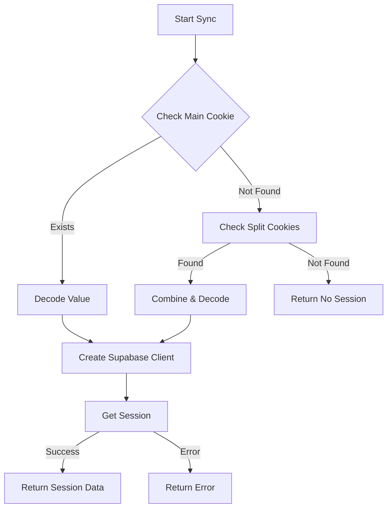

# Session Sync Fix Documentation

## The Problem

We encountered several issues with session handling in the Next.js application:

1. Cookie Awaiting Error:
   ```
   Error: Route "/api/auth/sync-session" used `cookies().get()`. `cookies()` should be awaited before using its value.
   ```

2. Split Cookie Parsing:
   ```
   Failed to parse cookie string: SyntaxError: Unexpected token 'b', "base64-eyJ"... is not valid JSON
   ```

3. Session Loss:
   - Session was valid in middleware but lost during sync
   - Split cookies weren't being properly combined and decoded

## The Solution

### 1. Proper Cookie Store Initialization

```typescript
// Get the cookie store and await it properly
const cookieStore = await cookies()
debug.log('SyncSession: Cookie store initialized')
```

### 2. Split Cookie Handling

We implemented a two-step process:
1. First check for main session cookie
2. If not found, try to combine split cookies

```typescript
// Try to get the main session cookie first
let sessionCookie = cookieStore.get('sb-bisimqmtxjsptehhqpeg-auth-token')
let sessionStr: string | null = null

if (!sessionCookie) {
  // Try to combine split cookies
  const part0 = cookieStore.get('sb-bisimqmtxjsptehhqpeg-auth-token.0')
  const part1 = cookieStore.get('sb-bisimqmtxjsptehhqpeg-auth-token.1')
  
  if (part0 && part1) {
    const combined = part0.value + part1.value
    sessionStr = decodeCookieValue(combined)
  }
}
```

### 3. Base64 Decoding

Added proper base64 decoding for cookie values:

```typescript
function decodeCookieValue(value: string): string | null {
  if (value.startsWith('base64-')) {
    try {
      const base64Value = value.replace('base64-', '')
      return Buffer.from(base64Value, 'base64').toString()
    } catch (error) {
      debug.error('SyncSession: Error decoding base64 value:', error)
      return null
    }
  }
  return value
}
```

### 4. Supabase Client Creation

Instead of trying to customize the cookie handling in the Supabase client, we:
1. Handle cookie combining and decoding ourselves
2. Create the Supabase client with standard cookie handling

```typescript
// Create Supabase client with the cookie store
const supabase = createRouteHandlerClient<Database>({ cookies })
```

## Key Improvements

1. **Reliability**: 
   - Session sync now works consistently
   - No more cookie parsing errors
   - Proper handling of split and base64-encoded cookies

2. **Debug Logging**:
   - Added detailed logging at each step
   - Clear visibility into cookie state and session handling

3. **Type Safety**:
   - Proper TypeScript types for all operations
   - No more type errors with cookie handling

## Flow Diagram



## Testing

The fix can be verified by:
1. Checking the debug logs for proper cookie handling
2. Verifying session persistence across page reloads
3. Confirming split cookie handling works
4. Ensuring base64 decoding succeeds

## Future Considerations

1. Monitor cookie sizes to prevent splitting when possible
2. Consider implementing cookie compression
3. Add more robust error recovery mechanisms
4. Consider caching session data to reduce cookie size 